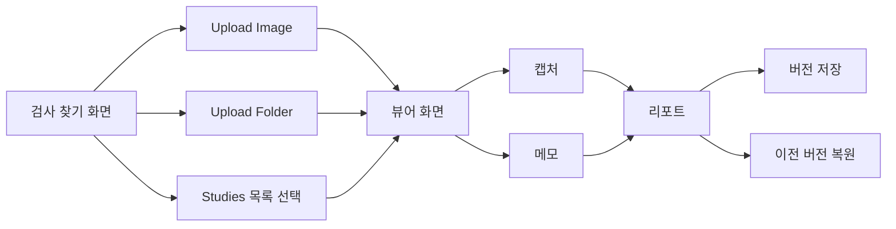
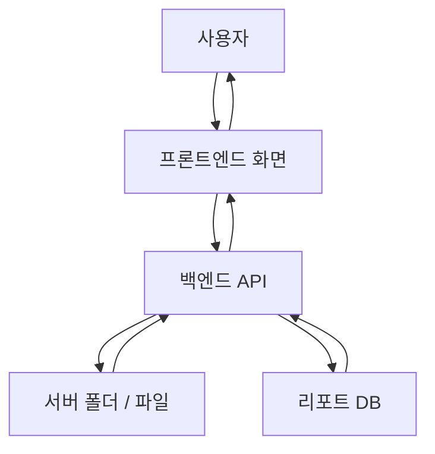
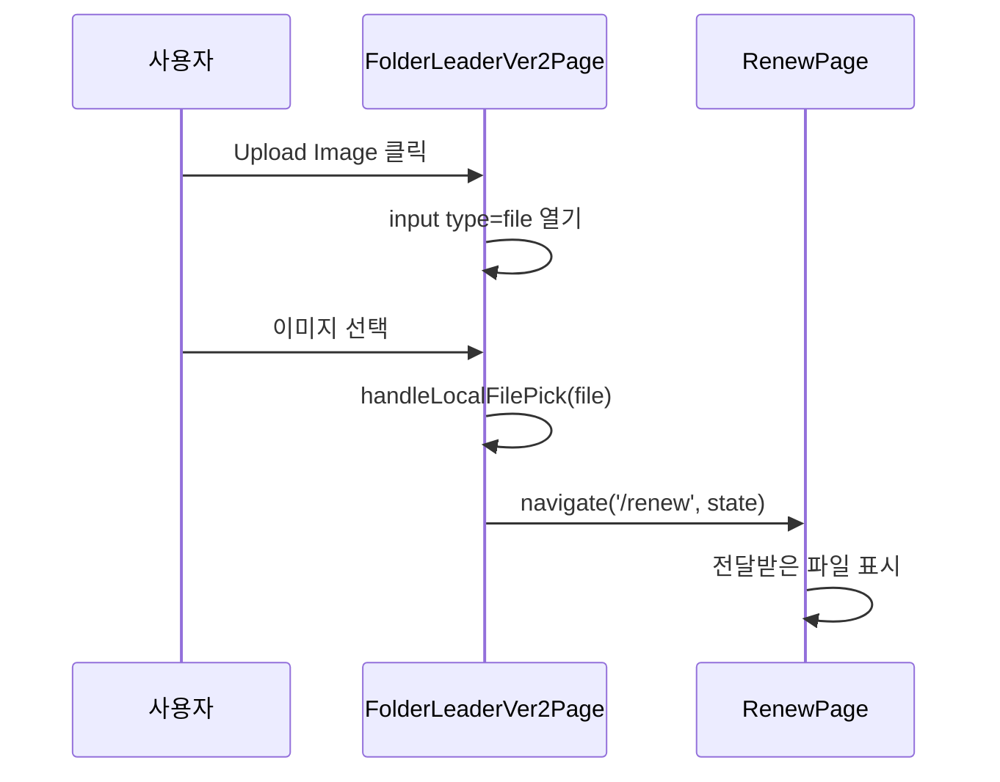
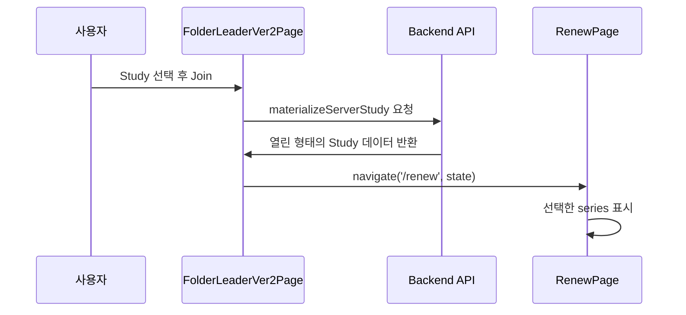
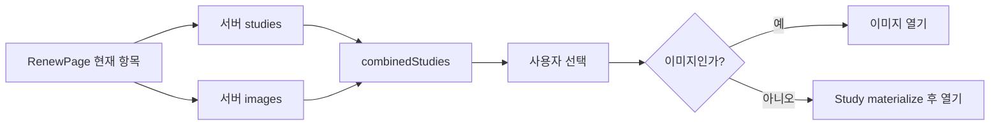
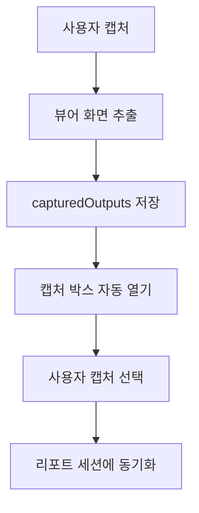
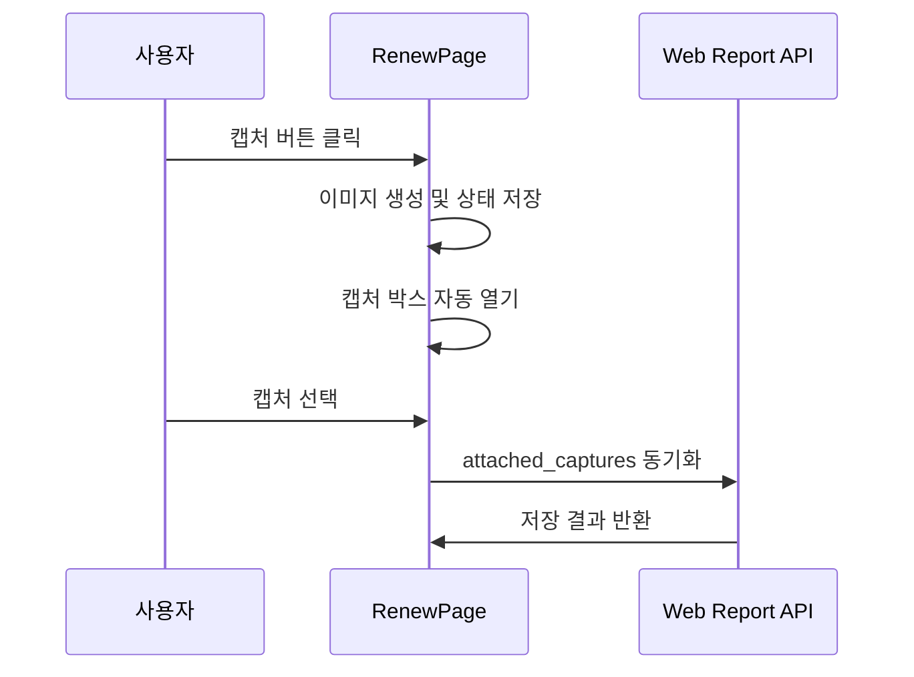
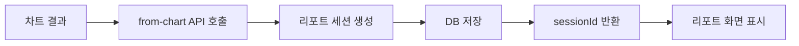
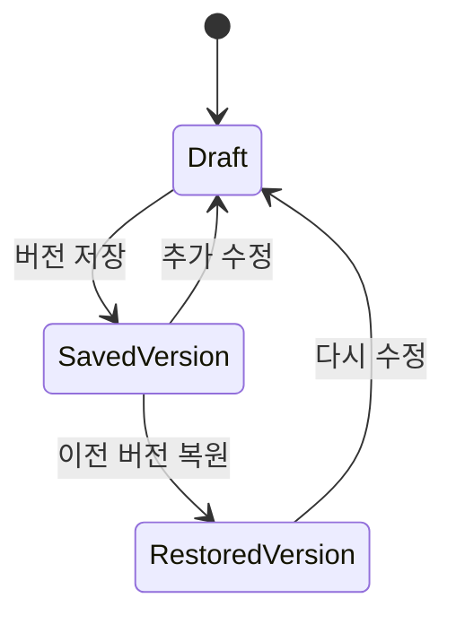
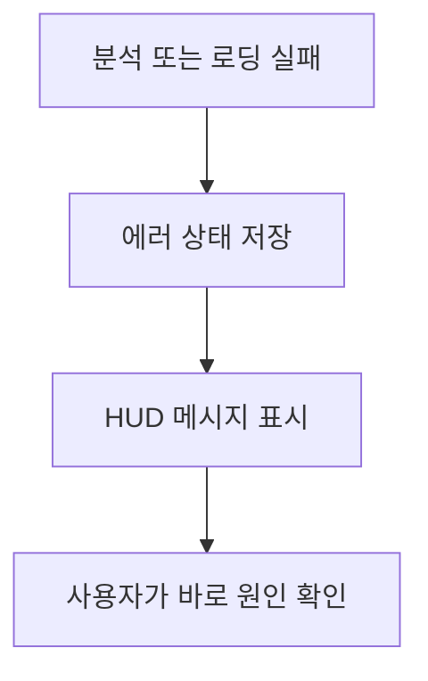

# 쉬운 사용 설명서 + 기능별 작동원리

이 문서는 처음 보는 사람도 이해할 수 있게 설명하고, 개발자가 봐도 흐름을 따라갈 수 있게 정리한 문서입니다.

더 자세한 구조 다이어그램은 [docs/dbm/README.md](/abs/path/c:/interface/docs/dbm/README.md)에서 문서별로 나눠 볼 수 있습니다.

쉽게 말하면 이 프로그램은:

- 검사 목록을 찾고
- 이미지나 DICOM을 열고
- 화면에서 확인하고
- 캡처와 메모를 남기고
- 리포트를 만드는 도구입니다

## 1. 이 프로그램은 무엇을 하나요?

치과 영상이나 DICOM 파일을 읽어서 화면에 보여주고, 사용자가 필요한 장면을 캡처하고, 마지막에 리포트까지 만들 수 있게 도와줍니다.

핵심 기능:

- 서버 폴더에서 검사 찾기
- 이미지 파일 직접 열기
- 폴더 단위로 DICOM 읽기
- 뷰어에서 검사 확인
- 캡처 저장과 선택
- 리포트 작성과 버전 관리

## 2. 먼저 알아두면 좋은 말

- `Image`
  - 일반 이미지 파일입니다. 예: `jpg`, `png`
- `DICOM`
  - 병원 영상에서 많이 쓰는 파일 형식입니다.
- `Study`
  - 한 번의 검사 묶음입니다.
- `Series`
  - 검사 안의 세부 묶음입니다.
- `Capture`
  - 화면에서 따로 잘라 저장한 장면입니다.
- `Report`
  - 최종 정리 문서입니다.

## 3. 화면은 크게 3개입니다

### 3.1 검사 찾기 화면

주소:

- `/folder_leader_ver_2`

역할:

- 서버 폴더 안의 검사 목록을 불러옵니다.
- 검색 조건으로 원하는 대상을 좁힙니다.
- `Upload Image`로 이미지 파일을 엽니다.
- `Upload Folder`로 폴더를 읽어 DICOM을 엽니다.
- `Studies` 목록에서 검사나 이미지를 선택합니다.

쉽게 말하면:

이 화면은 "무엇을 열지 고르는 입구"입니다.

관련 파일:

- [FolderLeaderVer2Page.tsx](/abs/path/c:/interface/frontend/src/pages/FolderLeaderVer2Page.tsx)
- [folderLeaderApi.ts](/abs/path/c:/interface/frontend/src/lib/folderLeaderApi.ts)
- [dicom_server_browser.py](/abs/path/c:/interface/gpts/api/dicom_server_browser.py)

### 3.2 뷰어 화면

주소:

- `/renew`

역할:

- 선택한 검사나 이미지를 크게 보여줍니다.
- `Studies` 패널에서 다른 검사로 바꿀 수 있습니다.
- 캡처를 하면 바로 캡처 박스가 열립니다.
- 에러가 나면 HUD처럼 화면 위쪽에 보입니다.
- 리포트 작업으로 넘어가기 전 확인 작업을 합니다.

쉽게 말하면:

이 화면은 "검사를 자세히 보는 작업대"입니다.

관련 파일:

- [RenewPage.tsx](/abs/path/c:/interface/frontend/src/pages/RenewPage.tsx)
- [RenewStudiesDock.tsx](/abs/path/c:/interface/frontend/src/components/chart/RenewStudiesDock.tsx)
- [OutputCapturePanel.tsx](/abs/path/c:/interface/frontend/src/components/chart/OutputCapturePanel.tsx)

### 3.3 리포트 화면

주소:

- `/report/:sessionId`

역할:

- 뷰어에서 만든 내용을 리포트로 정리합니다.
- 버전을 저장하고, 이전 버전으로 되돌릴 수 있습니다.
- `Report Note` 아래에서 버전 정보를 확인합니다.

쉽게 말하면:

이 화면은 "최종 문서를 쓰는 곳"입니다.

관련 파일:

- [WebReportPage.tsx](/abs/path/c:/interface/frontend/src/pages/WebReportPage.tsx)
- [webReportApi.ts](/abs/path/c:/interface/frontend/src/lib/webReportApi.ts)
- [web_report.py](/abs/path/c:/interface/gpts/api/web_report.py)
- [web_report_session_service.py](/abs/path/c:/interface/gpts/services/web_report_session_service.py)

## 4. 전체 흐름 한눈에 보기



## 5. 시스템 구조도



쉽게 설명하면:

- 사용자가 버튼을 누릅니다.
- 프론트엔드가 백엔드에게 데이터를 요청합니다.
- 백엔드는 파일이나 DB를 읽습니다.
- 결과를 다시 화면에 돌려줍니다.

## 6. 기능별 작동원리

아래부터는 각 기능이 "겉으로는 어떻게 보이고", "안에서는 어떻게 움직이는지"를 같이 설명합니다.

### 6.1 `Upload Image`

이 기능은 이미지 파일 하나를 바로 뷰어로 여는 기능입니다.

사용자가 보는 동작:

1. `Upload Image` 버튼 클릭
2. 파일 선택
3. 뷰어 화면으로 이동
4. 이미지 확인

안에서 일어나는 일:

1. 프론트엔드가 파일 선택창을 엽니다.
2. 선택한 파일을 `handleLocalFilePick`가 받습니다.
3. 페이지가 `/renew`로 이동합니다.
4. 이동할 때 파일 정보를 `state`에 실어 보냅니다.
5. `RenewPage`가 그 파일을 읽어 뷰어에 표시합니다.

작동 순서도:

```mermaid
flowchart TD
    A[Upload Image 클릭] --> B[파일 선택창 열기]
    B --> C[이미지 파일 선택]
    C --> D[handleLocalFilePick 실행]
    D --> E[/renew 로 이동]
    E --> F[RenewPage가 파일 표시]
```

개발자용 흐름:



관련 코드:

- [FolderLeaderVer2Page.tsx](/abs/path/c:/interface/frontend/src/pages/FolderLeaderVer2Page.tsx)
- [RenewPage.tsx](/abs/path/c:/interface/frontend/src/pages/RenewPage.tsx)

### 6.2 `Upload Folder`

이 기능은 폴더 안의 DICOM 파일들을 읽어서 검사 묶음으로 여는 기능입니다.

사용자가 보는 동작:

1. `Upload Folder` 클릭
2. 폴더 선택
3. 폴더 안 파일 분석
4. 뷰어 화면으로 이동

안에서 일어나는 일:

1. 프론트엔드가 폴더 선택창을 엽니다.
2. 폴더 안 파일 목록을 한 번에 읽습니다.
3. `buildDicomFolderStudies`가 파일을 `Study`와 `Series`로 묶습니다.
4. 첫 번째 시리즈를 기준으로 `/renew`로 이동합니다.
5. 뷰어가 그 시리즈를 먼저 보여줍니다.

작동 원리 그림:

```mermaid
flowchart LR
    A[폴더 선택] --> B[파일 목록 읽기]
    B --> C[DICOM 파일 판별]
    C --> D[Study/Series로 묶기]
    D --> E[/renew 이동]
    E --> F[첫 Series 표시]
```

중학생 버전 설명:

폴더를 그냥 여는 것이 아니라, 안에 있는 파일들을 검사별로 정리해서 "묶음"으로 만든 다음 보여주는 방식입니다.

관련 코드:

- [FolderLeaderVer2Page.tsx](/abs/path/c:/interface/frontend/src/pages/FolderLeaderVer2Page.tsx)
- [dicomFolderStudies.ts](/abs/path/c:/interface/frontend/src/features/upload/dicomFolderStudies.ts)
- [RenewPage.tsx](/abs/path/c:/interface/frontend/src/pages/RenewPage.tsx)

### 6.3 `Studies` 검색과 목록 표시

이 기능은 서버 폴더 안의 검사와 이미지 목록을 찾는 기능입니다.

사용자가 보는 동작:

1. 환자명, 날짜, 설명 같은 조건 입력
2. `Search` 클릭
3. 목록 갱신
4. 원하는 항목 선택

안에서 일어나는 일:

1. `loadStudies()`가 호출됩니다.
2. 프론트가 백엔드 API에 목록을 요청합니다.
3. 백엔드는 서버 폴더를 읽고 `studies`, `images` 목록을 만들어 돌려줍니다.
4. 프론트는 검색어로 한 번 더 화면 필터링을 합니다.
5. `Studies` 목록에 결과를 보여줍니다.

데이터 흐름:

```mermaid
flowchart TD
    A[Search 클릭] --> B[loadStudies]
    B --> C[fetchServerFolderIndex]
    C --> D[/api/dicom-server/studies]
    D --> E[서버 폴더 스캔]
    E --> F[studies/images JSON]
    F --> G[프론트 상태 저장]
    G --> H[검색 조건으로 필터]
    H --> I[목록 렌더링]
```

개발자용 참고:

- 서버에서 `studies`와 `images`를 함께 내려줍니다.
- 프론트에서는 이를 각각 가공한 뒤 목록 형태로 합쳐 보여줄 수 있습니다.
- 최근 변경으로 상단 `Images` 버튼은 제거되고, 상단은 더 단순해졌습니다.

관련 코드:

- [FolderLeaderVer2Page.tsx](/abs/path/c:/interface/frontend/src/pages/FolderLeaderVer2Page.tsx)
- [folderLeaderApi.ts](/abs/path/c:/interface/frontend/src/lib/folderLeaderApi.ts)
- [dicom_server_browser.py](/abs/path/c:/interface/gpts/api/dicom_server_browser.py)

### 6.4 서버 목록에서 검사나 이미지를 열기

이 기능은 목록에서 선택한 검사나 이미지를 실제 뷰어로 연결하는 기능입니다.

경우는 2가지입니다.

- `Study`를 연다
- `Image`를 연다

`Study`를 여는 원리:

1. 사용자가 항목을 더블클릭하거나 `Join` 클릭
2. `openStudyEntry()` 실행
3. 백엔드가 서버 쪽 검사 정보를 실제 열 수 있는 형태로 준비
4. `/renew`로 이동

`Image`를 여는 원리:

1. 사용자가 이미지 항목 선택
2. `openImage()` 실행
3. 이미지 URL을 뷰어에 전달
4. `/renew`에서 표시

비교 표:

| 기능 | 시작점 | 중간 처리 | 도착 화면 |
| --- | --- | --- | --- |
| Study 열기 | `Join` / 더블클릭 | `materializeServerStudy` | `/renew` |
| Image 열기 | `Open` / 더블클릭 | 다운로드 URL 정리 | `/renew` |

시퀀스 다이어그램:



관련 코드:

- [FolderLeaderVer2Page.tsx](/abs/path/c:/interface/frontend/src/pages/FolderLeaderVer2Page.tsx)
- [folderLeaderApi.ts](/abs/path/c:/interface/frontend/src/lib/folderLeaderApi.ts)
- [RenewPage.tsx](/abs/path/c:/interface/frontend/src/pages/RenewPage.tsx)

### 6.5 뷰어에서 `Studies` 패널로 바꾸기

이 기능은 뷰어 안에서 다른 검사나 이미지로 갈아타는 기능입니다.

사용자가 보는 동작:

1. 뷰어 왼쪽에서 `Studies` 열기
2. 다른 항목 선택
3. 같은 화면 안에서 대상 변경

안에서 일어나는 일:

1. `RenewPage`가 현재 열려 있는 검사 외에 서버 목록도 따로 들고 있습니다.
2. 서버의 `studies`와 `images`를 합쳐서 `combinedStudies`를 만듭니다.
3. 사용자가 항목을 누르면 DICOM인지 이미지인지 판단합니다.
4. 맞는 방식으로 뷰어 상태를 바꿉니다.

최근 변경 포인트:

- 서버 이미지 상태에서도 `Studies`를 누르면 다른 `img`, `dcm`이 함께 보이도록 조정됨

작동 그림:



관련 코드:

- [RenewPage.tsx](/abs/path/c:/interface/frontend/src/pages/RenewPage.tsx)
- [RenewStudiesDock.tsx](/abs/path/c:/interface/frontend/src/components/chart/RenewStudiesDock.tsx)
- [StudiesWorkspacePanel.tsx](/abs/path/c:/interface/frontend/src/components/chart/StudiesWorkspacePanel.tsx)

### 6.6 캡처 기능

이 기능은 화면의 특정 장면을 저장하고, 바로 캡처 박스를 열어 주는 기능입니다.

사용자가 보는 동작:

1. 뷰어에서 캡처
2. 바로 캡처 박스 열림
3. 캡처 목록에서 선택 가능
4. 리포트에 붙일 수 있음

안에서 일어나는 일:

1. 뷰어 화면을 캔버스나 이미지 형태로 만듭니다.
2. `capturedOutputs` 상태에 저장합니다.
3. 방금 만든 캡처를 선택 상태로 바꿉니다.
4. 캡처 패널이 바로 열리도록 UI 상태를 바꿉니다.
5. 선택된 캡처는 리포트 세션으로 동기화됩니다.

흐름도:



시퀀스 다이어그램:



관련 코드:

- [RenewPage.tsx](/abs/path/c:/interface/frontend/src/pages/RenewPage.tsx)
- [OutputCapturePanel.tsx](/abs/path/c:/interface/frontend/src/components/chart/OutputCapturePanel.tsx)
- [RenewReportWorkspacePanel.tsx](/abs/path/c:/interface/frontend/src/components/chart/RenewReportWorkspacePanel.tsx)
- [web_report.py](/abs/path/c:/interface/gpts/api/web_report.py)

### 6.7 리포트 생성

이 기능은 뷰어에서 보던 내용을 리포트 세션으로 넘겨 문서화하는 기능입니다.

사용자가 보는 동작:

1. 리포트 패널 열기
2. 노트, 치아 정보, 캡처 확인
3. 문서 미리보기 보기

안에서 일어나는 일:

1. 차트 정보가 `/api/web_report/from-chart`로 전달됩니다.
2. 백엔드가 리포트 세션을 만듭니다.
3. 세션 정보는 DB에 저장됩니다.
4. 프론트는 세션 ID를 받아 리포트 화면을 엽니다.
5. 이후 수정 내용은 override 형태로 계속 저장됩니다.

작동 순서:



관련 코드:

- [RenewPage.tsx](/abs/path/c:/interface/frontend/src/pages/RenewPage.tsx)
- [webReportApi.ts](/abs/path/c:/interface/frontend/src/lib/webReportApi.ts)
- [web_report.py](/abs/path/c:/interface/gpts/api/web_report.py)
- [web_report_report_service.py](/abs/path/c:/interface/gpts/services/web_report_report_service.py)

### 6.8 리포트 버전 저장과 되돌리기

이 기능은 문서를 안전하게 관리하기 위한 기능입니다.

사용자가 보는 동작:

1. 리포트 수정
2. 버전 저장
3. 이전 버전 선택
4. 복원 결과 확인

안에서 일어나는 일:

1. 현재 리포트 상태를 백엔드에 저장합니다.
2. `current_report_version` 값이 함께 관리됩니다.
3. 예전 버전을 선택하면 해당 시점의 스냅샷을 읽습니다.
4. 스냅샷을 다시 `doctor_overrides` 형태로 복원합니다.
5. 프론트는 복원된 값을 받아 화면에 다시 그립니다.

상태 변화도:



중요한 최근 수정:

- 버전 복원 시 과거 버전으로 제대로 돌아가지 않던 문제를 보강함
- 세션 응답에 `current_report_version`이 포함되도록 수정됨
- 버전 위치가 `Report Note` 아래로 이동함

관련 코드:

- [WebReportPage.tsx](/abs/path/c:/interface/frontend/src/pages/WebReportPage.tsx)
- [RenewReportWorkspacePanel.tsx](/abs/path/c:/interface/frontend/src/components/chart/RenewReportWorkspacePanel.tsx)
- [web_report.py](/abs/path/c:/interface/gpts/api/web_report.py)
- [web_report_merge_service.py](/abs/path/c:/interface/gpts/services/web_report_merge_service.py)
- [web_report_session_service.py](/abs/path/c:/interface/gpts/services/web_report_session_service.py)

### 6.9 에러를 HUD로 보여주는 이유

이 기능은 오류를 숨기지 않고, 사용자가 바로 보게 하려는 목적입니다.

왜 필요한가:

- 파노가 없는데 아무 말도 안 나오면 사용자는 멈춘 줄 압니다.
- 그래서 화면 위에 바로 보이는 경고가 필요합니다.

작동 방식:

1. 뷰어 로딩 또는 분석 중 문제가 생김
2. 프론트가 에러 상태를 저장
3. HUD 스타일 경고 표시

간단 그림:



관련 코드:

- [RenewPage.tsx](/abs/path/c:/interface/frontend/src/pages/RenewPage.tsx)

## 7. 기능별 프론트-백엔드 연결표

| 기능 | 프론트엔드 | 백엔드/API | 저장 위치 |
| --- | --- | --- | --- |
| Upload Image | `FolderLeaderVer2Page` | 없음 또는 뷰어 진입 상태 전달 | 브라우저 상태 |
| Upload Folder | `FolderLeaderVer2Page` | 없음 또는 후속 viewer 처리 | 브라우저 상태 |
| Studies 검색 | `FolderLeaderVer2Page` | `dicom_server_browser.py` | 서버 폴더 |
| Study 열기 | `FolderLeaderVer2Page` | `folderLeaderApi` | 서버 폴더 |
| 캡처 동기화 | `RenewPage` | `web_report.py` | 리포트 세션 DB |
| 리포트 생성 | `RenewPage` | `/api/web_report/from-chart` | `web_report.db` |
| 버전 복원 | `WebReportPage` | `web_report.py` + services | `web_report.db` |

## 8. 최근 반영된 사용성 포인트

- 캡처 후 바로 캡처 박스가 열립니다.
- `Studies`에서 DICOM과 이미지가 함께 보일 수 있습니다.
- `Search` 버튼 오타가 수정됐습니다.
- 상단 `Images` 버튼은 제거됐습니다.
- 업로드는 `Upload Image`, `Upload Folder` 두 버튼으로 나뉘어 있습니다.
- 리포트 버전 위치는 `Report Note` 아래입니다.

## 9. 문제가 생기면 어디를 보면 되나요?

### 이미지가 안 열릴 때

- 파일 형식이 맞는지 확인합니다.
- `Upload Image`와 `Upload Folder`를 헷갈리지 않았는지 확인합니다.
- 서버 목록이면 `Refresh` 또는 `Search`를 다시 눌러 봅니다.

### DICOM 폴더가 이상할 때

- 폴더 안에 실제 `dcm` 파일이 있는지 확인합니다.
- 한 폴더 안 구조가 너무 섞여 있지 않은지 확인합니다.

### 파노 관련 오류가 날 때

- 뷰어 위쪽 HUD에 에러가 뜨는지 확인합니다.
- 같은 검사를 다시 열어 봅니다.

### 리포트가 이상할 때

- 현재 버전과 이전 버전을 비교합니다.
- `Report Note` 아래 버전 영역을 확인합니다.

## 10. 개발자가 보면 좋은 파일 지도

- 메인 검사 선택 화면: [FolderLeaderVer2Page.tsx](/abs/path/c:/interface/frontend/src/pages/FolderLeaderVer2Page.tsx)
- 뷰어 화면: [RenewPage.tsx](/abs/path/c:/interface/frontend/src/pages/RenewPage.tsx)
- 리포트 화면: [WebReportPage.tsx](/abs/path/c:/interface/frontend/src/pages/WebReportPage.tsx)
- 서버 폴더 API: [dicom_server_browser.py](/abs/path/c:/interface/gpts/api/dicom_server_browser.py)
- 리포트 API: [web_report.py](/abs/path/c:/interface/gpts/api/web_report.py)
- 리포트 세션 저장: [web_report_session_service.py](/abs/path/c:/interface/gpts/services/web_report_session_service.py)
- 다른 PC 배포 방법: [BUILD_OTHER_PC.md](/abs/path/c:/interface/docs/BUILD_OTHER_PC.md)

## 11. 아주 짧게 정리

이 프로그램은

- 검사 찾기
- 이미지나 DICOM 열기
- 화면에서 확인하기
- 캡처와 메모 남기기
- 리포트 만들기

를 한 번에 할 수 있게 만든 도구입니다.

처음 쓰는 사람은 아래 순서만 기억하면 됩니다.

1. `Upload Image` 또는 `Upload Folder`
2. 검사 열기
3. 뷰어에서 확인
4. 캡처와 메모
5. 리포트 작성
