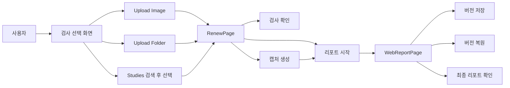

# 현재 빌드 제품 설명과 사용자 흐름

## 1. 이 빌드가 하는 일

이 빌드는 치과 이미지와 DICOM 검사를 읽고, 뷰어에서 검토하고, 캡처를 모으고, 리포트를 작성하게 만든 빌드다.

핵심 화면은 3개로 정리했음.

- `FolderLeaderVer2Page`가 검사 선택과 업로드를 담당한다.
- `RenewPage`가 뷰어와 캡처와 리포트 진입을 담당한다.
- `WebReportPage`가 리포트 편집과 버전 관리를 담당한다.

## 2. 화면 역할

### 2.1 검사 선택 화면

주소는 `/folder_leader_ver_2`다.

이 화면은 아래 일을 담당한다.

- 서버 폴더를 스캔해서 검사 목록을 보여준다.
- `Upload Image`로 단일 이미지 파일을 연다.
- `Upload Folder`로 DICOM 폴더를 읽는다.
- `Studies` 목록에서 DICOM study와 일반 이미지를 함께 다룬다.

### 2.2 뷰어 화면

주소는 `/renew`다.

이 화면은 아래 일을 담당한다.

- 선택한 study 또는 image를 크게 보여준다.
- 뷰어 안에서 다른 study나 image로 전환한다.
- 캡처를 생성하고 바로 캡처 박스를 연다.
- 리포트 세션을 만들고 리포트 작업으로 연결한다.

### 2.3 리포트 화면

주소는 `/report/:sessionId`다.

이 화면은 아래 일을 담당한다.

- 초안 리포트를 편집한다.
- 치아별 override를 저장한다.
- 첨부 캡처와 report note를 저장한다.
- 버전을 저장하고 과거 버전을 복원한다.

## 3. 사용자 기준 전체 흐름

## 4. 가장 자주 쓰는 시나리오

### 4.1 이미지 파일 하나를 열 때

1. `Upload Image`를 눌렀다.
2. 파일을 골랐다.
3. 뷰어 화면으로 이동했다.
4. 캡처를 만들었다.
5. 리포트로 넘어갔다.

### 4.2 DICOM 폴더를 열 때

1. `Upload Folder`를 눌렀다.
2. 폴더를 골랐다.
3. 브라우저가 폴더 안 DICOM 파일을 읽었다.
4. 파일을 study와 series로 묶었다.
5. 첫 series를 기준으로 뷰어를 열었다.

### 4.3 서버 폴더에서 검사를 찾을 때

1. 검색 조건을 입력했다.
2. `Search`를 눌렀다.
3. 서버 목록이 다시 계산됐다.
4. study 또는 image를 골랐다.
5. `Join` 또는 더블클릭으로 뷰어를 열었다.

## 5. 현재 빌드에서 바로 알아야 할 UI 규칙

- 상단 `Images` 버튼은 제거했음.
- 상단 검색 영역에서는 `Studies`만 노출했음.
- 업로드 버튼은 `Upload Image`, `Upload Folder` 두 개로 분리했음.
- 캡처를 만들면 캡처 박스를 바로 열게 했음.
- 리포트 버전 영역은 `Report Note` 아래에 배치했음.

## 6. 이 문서를 먼저 읽어야 하는 대상

- 서비스 흐름을 먼저 알고 싶은 신규 참여자에게 맞췄다.
- 코드를 열기 전에 제품 구조부터 잡아야 하는 개발자에게 맞췄다.
- 테스트 시나리오를 짜야 하는 QA에게 맞췄다.

