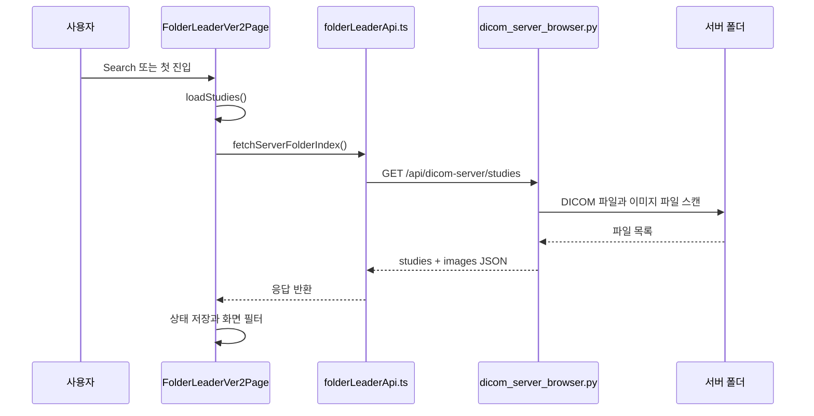
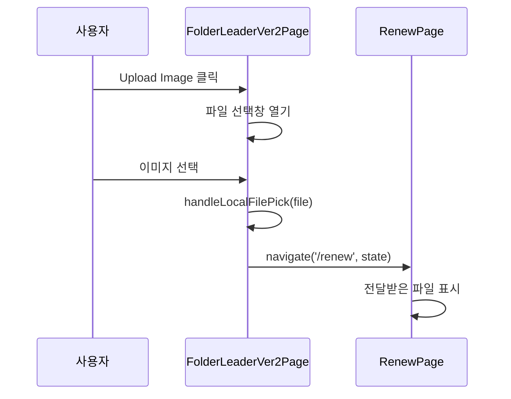
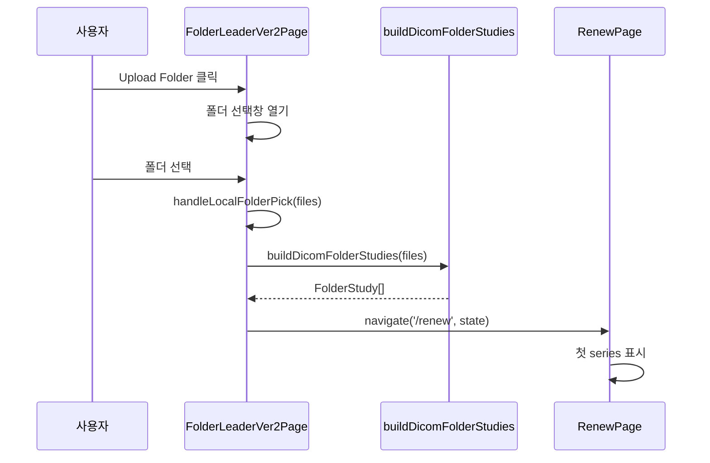
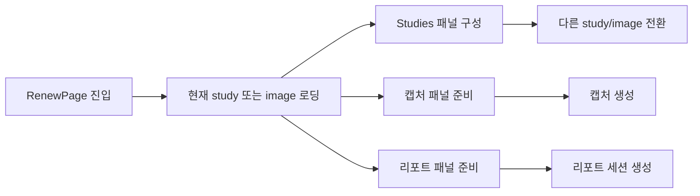
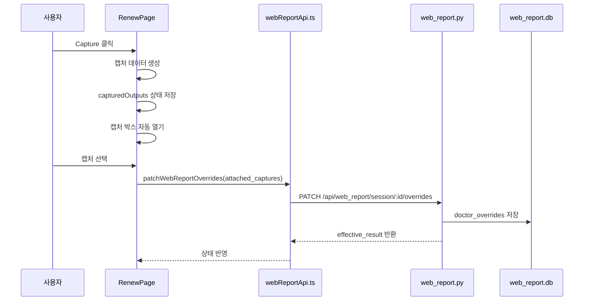
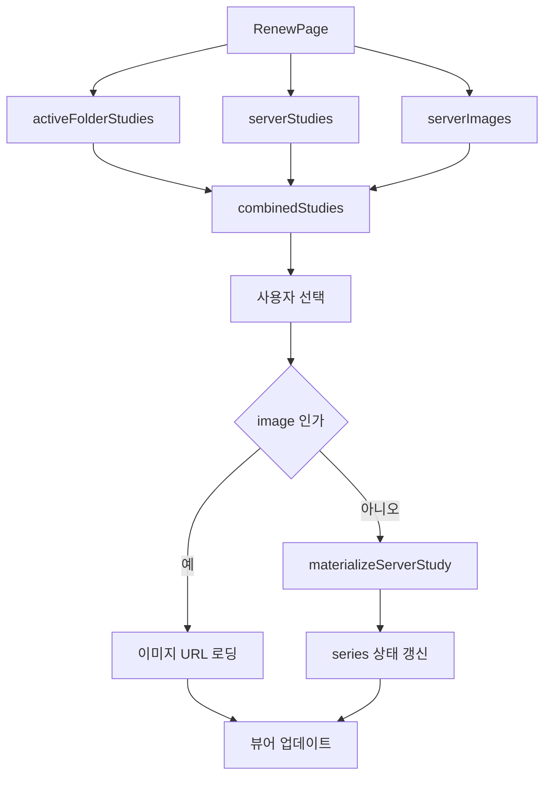
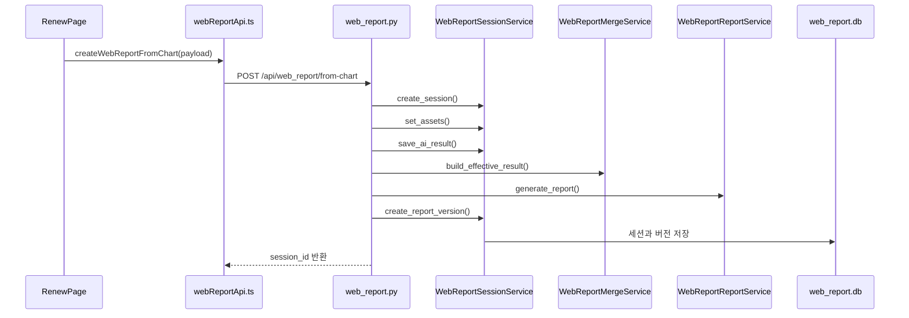
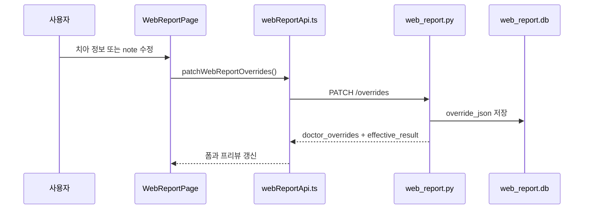
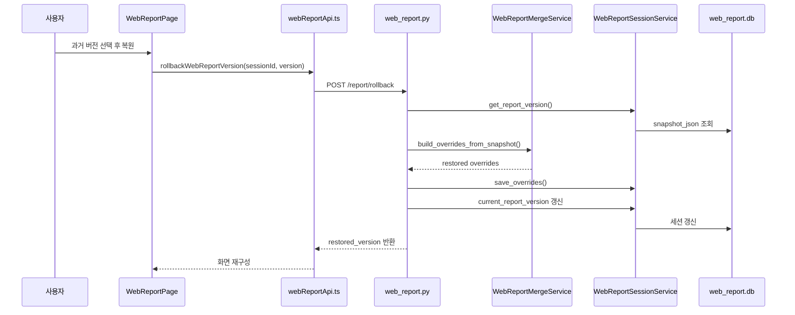

# 현재 빌드 런타임 흐름과 데이터 흐름

## 1. 프론트엔드에서 백엔드로 가는 전체 흐름

```mermaid
flowchart TD
    A[FolderLeaderVer2Page] --> B[folderLeaderApi.ts]
    B --> C[/api/dicom-server/studies]
    C --> D[dicom_server_browser.py]
    D --> E[(서버 DICOM 폴더)]
    E --> D
    D --> C
    C --> B
    B --> A

    A --> F[RenewPage]
    F --> G[webReportApi.ts]
    G --> H[/api/web_report/from-chart]
    H --> I[web_report.py]
    I --> J[WebReportSessionService]
    I --> K[WebReportMergeService]
    I --> L[WebReportReportService]
    J --> M[(web_report.db)]
    L --> N[(runs/web_report/session_id)]
```

## 2. 검사 선택 화면 런타임

### 2.1 서버 목록 로딩



### 2.2 `Upload Image` 흐름



### 2.3 `Upload Folder` 흐름



## 3. 뷰어 화면 런타임

### 3.1 뷰어 진입 후 작업 흐름



### 3.2 캡처와 리포트 동기화



### 3.3 뷰어 안 `Studies` 전환



## 4. 리포트 런타임

### 4.1 차트에서 리포트 세션을 만들 때



### 4.2 리포트 화면 편집 흐름



### 4.3 버전 복원 흐름



## 5. 데이터 저장 위치

### 5.1 DB 저장

`web_report.db`는 아래 정보를 저장한다.

- 세션 기본 정보
- 자산 경로
- AI 결과
- 의사 override
- 리포트 버전 스냅샷

### 5.2 파일 저장

`runs/web_report/<session_id>`는 아래 구조로 저장한다.

- `source`
- `inference`
- `reports`
- `final`

## 6. 이 문서에서 확인해야 하는 코드

- [FolderLeaderVer2Page.tsx](/abs/path/c:/interface/frontend/src/pages/FolderLeaderVer2Page.tsx)
- [dicomFolderStudies.ts](/abs/path/c:/interface/frontend/src/features/upload/dicomFolderStudies.ts)
- [folderLeaderApi.ts](/abs/path/c:/interface/frontend/src/lib/folderLeaderApi.ts)
- [RenewPage.tsx](/abs/path/c:/interface/frontend/src/pages/RenewPage.tsx)
- [WebReportPage.tsx](/abs/path/c:/interface/frontend/src/pages/WebReportPage.tsx)
- [webReportApi.ts](/abs/path/c:/interface/frontend/src/lib/webReportApi.ts)
- [dicom_server_browser.py](/abs/path/c:/interface/gpts/api/dicom_server_browser.py)
- [web_report.py](/abs/path/c:/interface/gpts/api/web_report.py)

