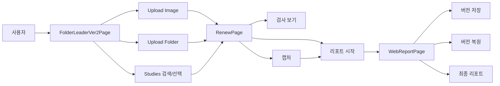
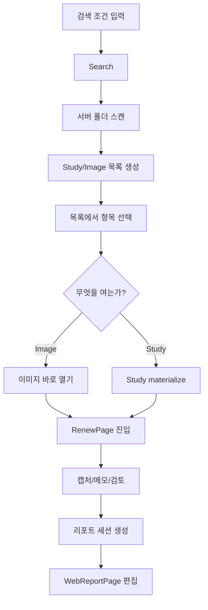
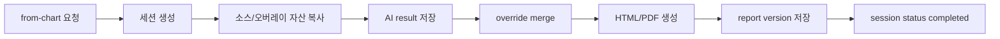
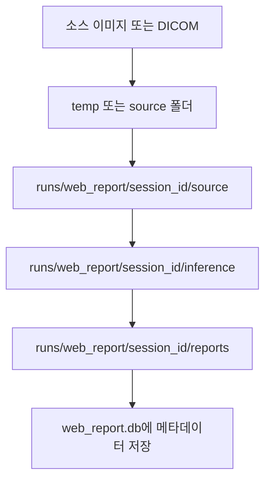

# 전체 워크플로우

이 문서는 사용자가 프로그램에 들어와서 검사 선택, 뷰어 확인, 캡처, 리포트 저장까지 가는 전체 흐름을 보여줍니다.

## 1. 사용자 기준 전체 흐름



## 2. 프론트엔드-백엔드 전체 흐름

```mermaid
flowchart TD
    U[사용자 입력] --> FE1[FolderLeaderVer2Page]
    FE1 --> API1[/api/dicom-server/studies]
    API1 --> FS[(서버 폴더)]
    FS --> API1
    API1 --> FE1

    FE1 --> FE2[RenewPage]
    FE2 --> API2[/api/web_report/from-chart]
    API2 --> SVC1[WebReportSessionService]
    API2 --> SVC2[WebReportMergeService]
    API2 --> SVC3[WebReportReportService]
    SVC1 --> DB[(web_report.db)]
    SVC3 --> RUNS[(runs/web_report/session_id)]

    FE2 --> FE3[WebReportPage]
    FE3 --> API3[/api/web_report/session/:id]
    API3 --> DB
    DB --> API3
    API3 --> FE3
```

## 3. 검사 탐색에서 리포트까지



## 4. 백엔드 리포트 처리 파이프라인



## 5. 물리 저장 위치 흐름



관련 파일:

- [FolderLeaderVer2Page.tsx](/abs/path/c:/interface/frontend/src/pages/FolderLeaderVer2Page.tsx)
- [RenewPage.tsx](/abs/path/c:/interface/frontend/src/pages/RenewPage.tsx)
- [WebReportPage.tsx](/abs/path/c:/interface/frontend/src/pages/WebReportPage.tsx)
- [dicom_server_browser.py](/abs/path/c:/interface/gpts/api/dicom_server_browser.py)
- [web_report.py](/abs/path/c:/interface/gpts/api/web_report.py)

