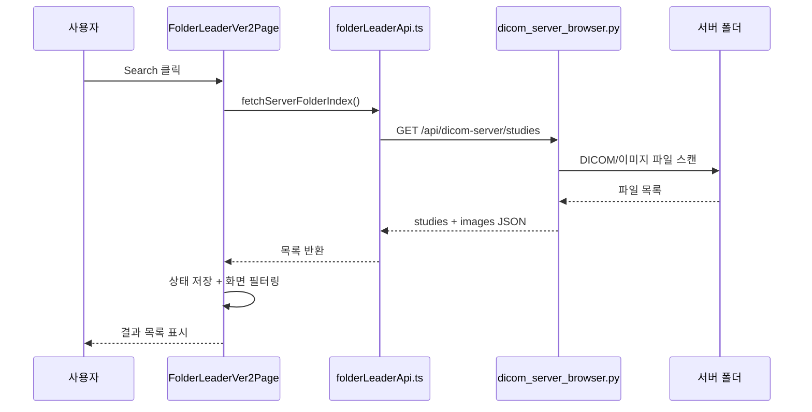
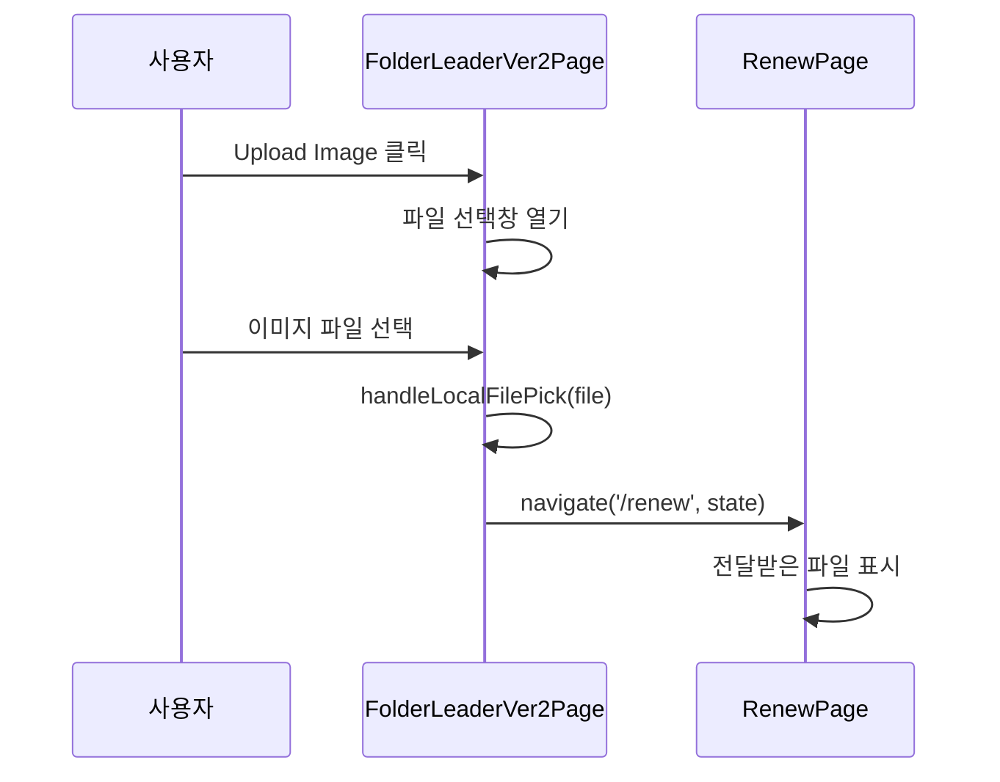
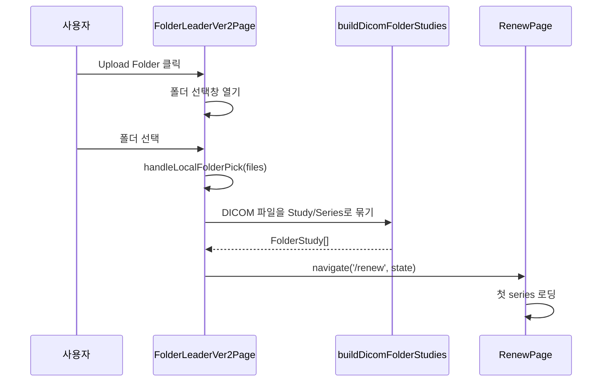
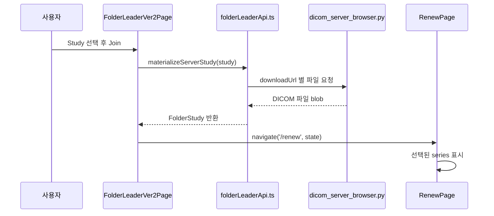
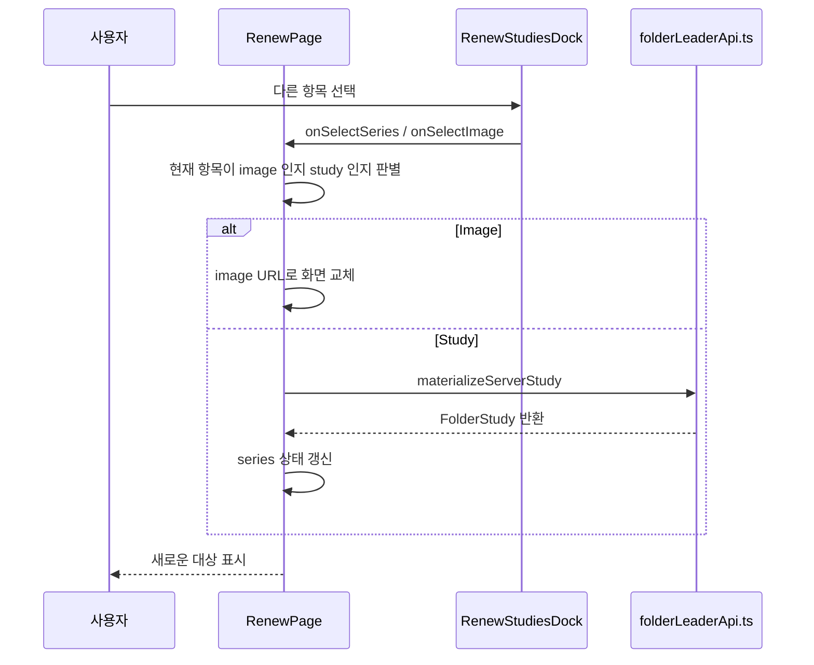
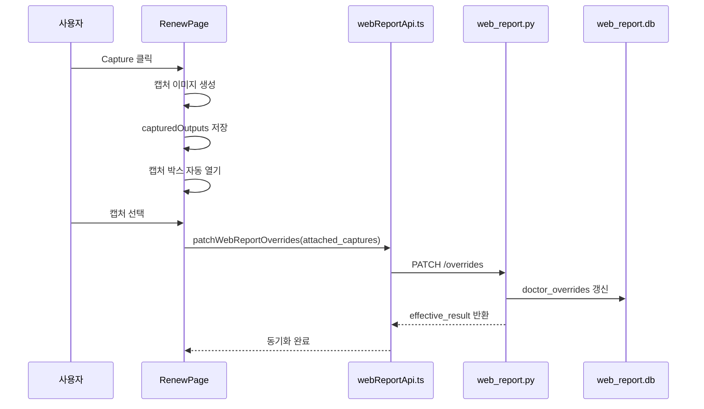
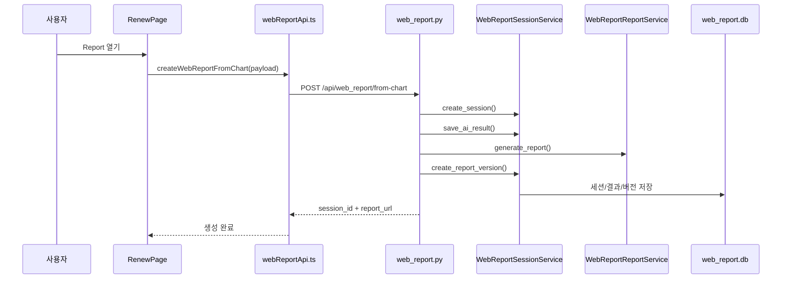
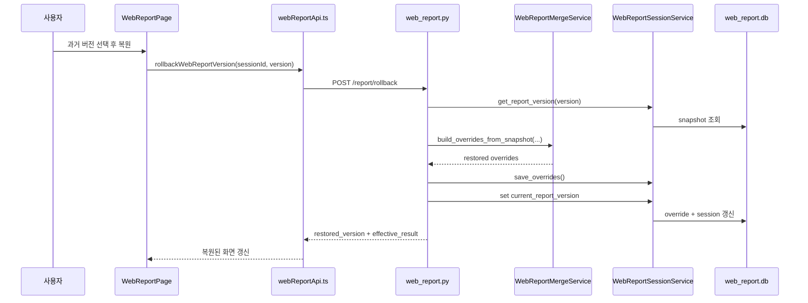

# 기능별 시퀀스 다이어그램

이 문서는 실제 기능이 어떤 순서로 호출되는지 보여줍니다.

## 1. `Studies` 검색

## 2. `Upload Image`

## 3. `Upload Folder`

## 4. 서버 목록에서 `Study` 열기

## 5. 뷰어에서 다른 `Study/Image`로 전환

## 6. 캡처 생성과 리포트 동기화

## 7. 차트에서 리포트 세션 생성

## 8. 리포트 버전 복원

