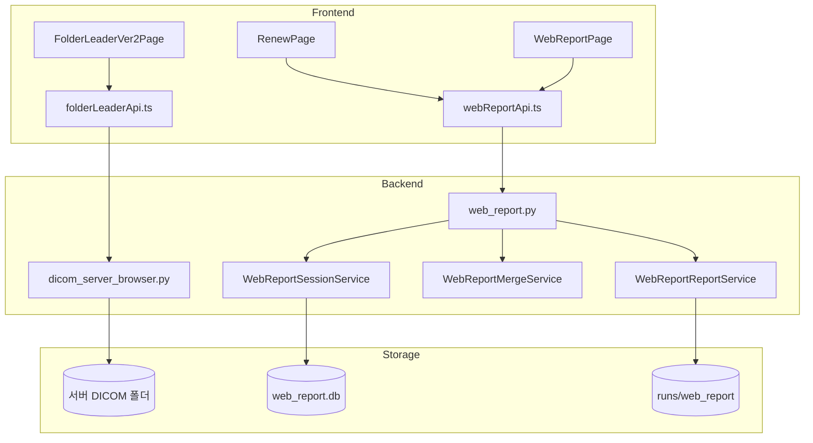
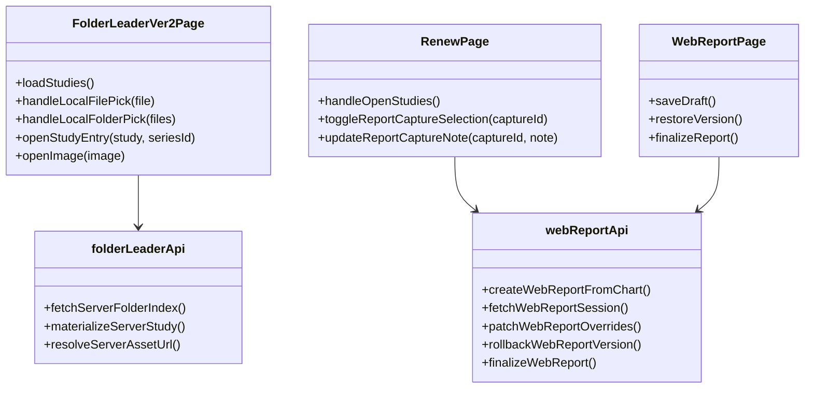
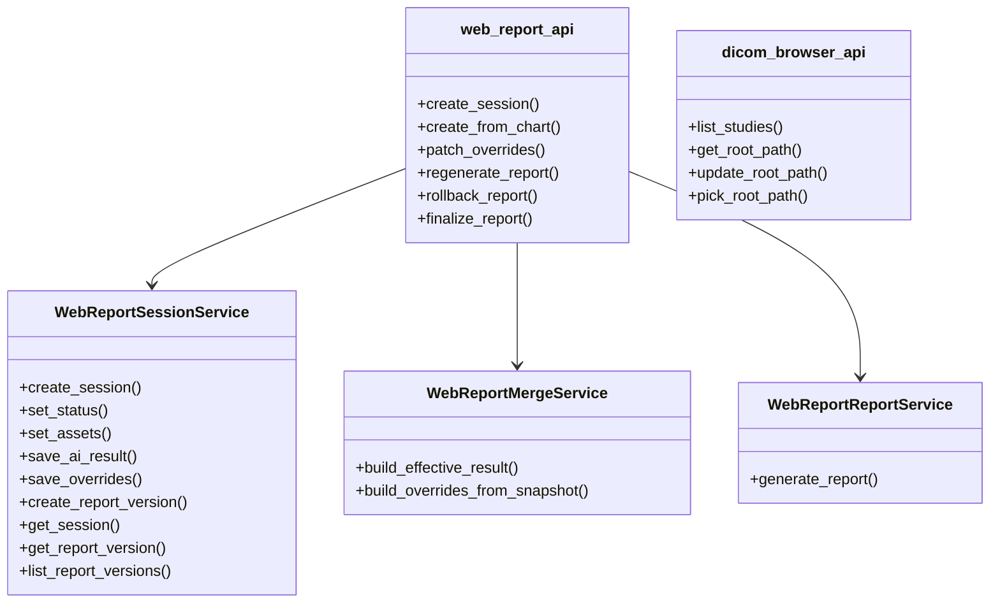
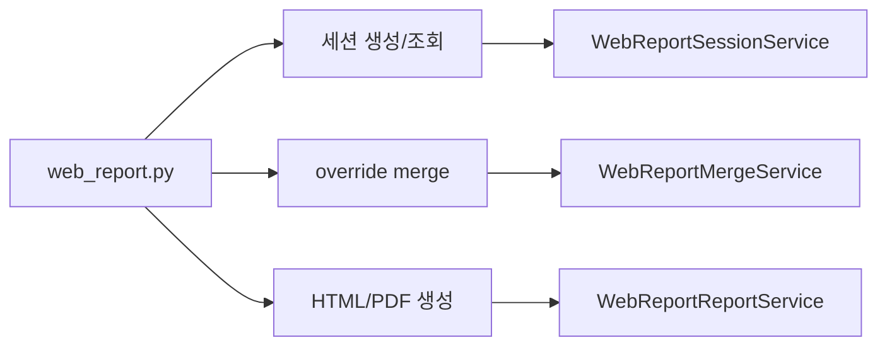

# 구조도와 클래스/모듈 다이어그램

이 문서는 프론트엔드, 백엔드, 서비스 계층이 어떻게 나뉘는지 보여줍니다.

## 1. 상위 구조도

## 2. 프론트엔드 모듈 클래스 다이어그램

## 3. 백엔드 서비스 클래스 다이어그램

## 4. 리포트 생성 책임 분리

## 5. 파일별 역할 요약

| 파일 | 역할 |
| --- | --- |
| `FolderLeaderVer2Page.tsx` | 검색, 업로드, 목록 선택 |
| `folderLeaderApi.ts` | 서버 폴더 API 호출 |
| `RenewPage.tsx` | 뷰어, 캡처, 리포트 진입 |
| `webReportApi.ts` | 리포트 API 호출 |
| `WebReportPage.tsx` | 리포트 편집/저장/복원 |
| `dicom_server_browser.py` | 서버 폴더 스캔과 목록 생성 |
| `web_report.py` | 리포트 API 엔드포인트 |
| `WebReportSessionService` | SQLite 저장/조회 |
| `WebReportMergeService` | AI 결과와 의사 수정치 병합 |
| `WebReportReportService` | 문서 파일 생성 |

