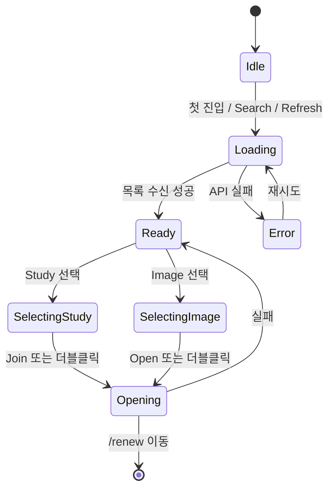
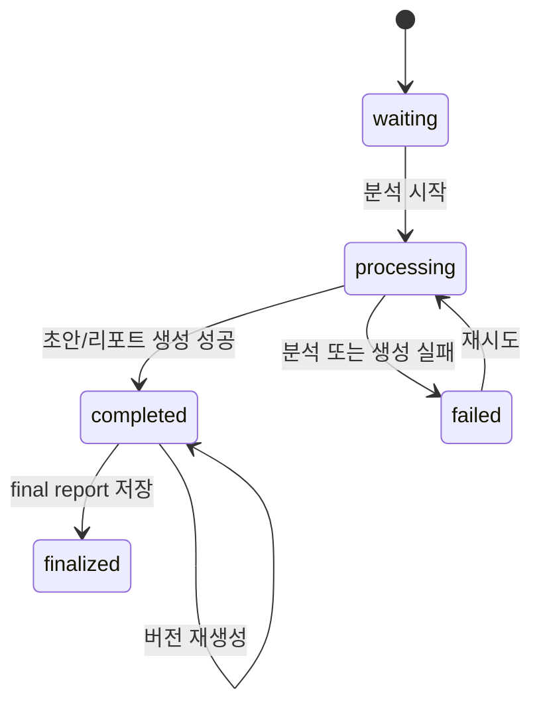
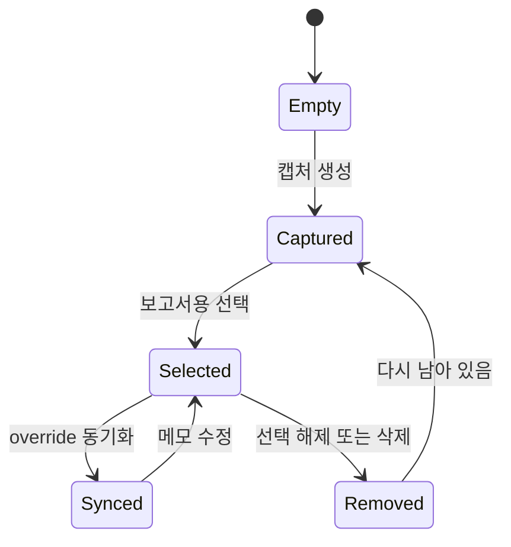
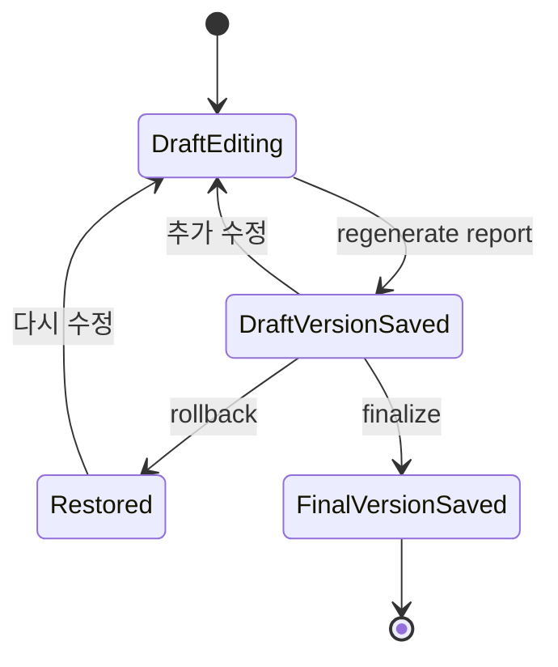
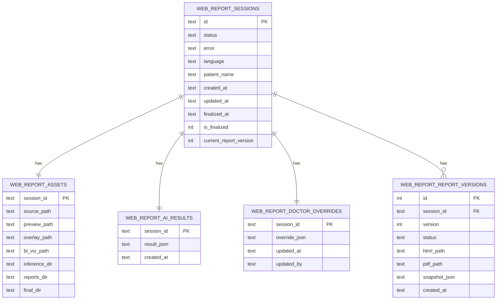
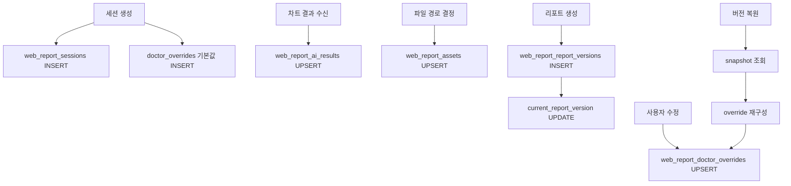
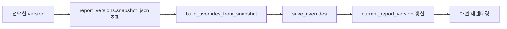

# 상태 다이어그램과 DB 구조

이 문서는 화면 상태, 세션 상태, 그리고 DB 구조를 함께 보여줍니다.

## 1. 검사 찾기 화면 상태

## 2. 리포트 세션 상태

`web_report_sessions.status` 기준으로 보면 아래처럼 움직입니다.

주의:

- DB의 `status`는 `waiting`, `processing`, `completed`, `failed` 흐름을 관리합니다.
- `is_finalized`와 `current_report_version`은 별도 컬럼으로 최종 상태와 현재 버전을 관리합니다.

## 3. 캡처 상태

## 4. 리포트 버전 상태

## 5. DB ER 다이어그램

`web_report.db` 안의 대표 테이블 구조입니다.

## 6. DB 저장 흐름

## 7. 스냅샷 복원 원리

버전 복원은 단순히 HTML 파일만 바꾸는 것이 아니라, `snapshot_json`을 읽어서 다시 `doctor_overrides`로 되돌리는 방식입니다.

관련 파일:

- [web_report_session_service.py](/abs/path/c:/interface/gpts/services/web_report_session_service.py)
- [web_report_merge_service.py](/abs/path/c:/interface/gpts/services/web_report_merge_service.py)
- [web_report.py](/abs/path/c:/interface/gpts/api/web_report.py)
- [WebReportPage.tsx](/abs/path/c:/interface/frontend/src/pages/WebReportPage.tsx)

