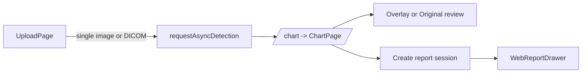
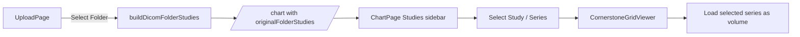
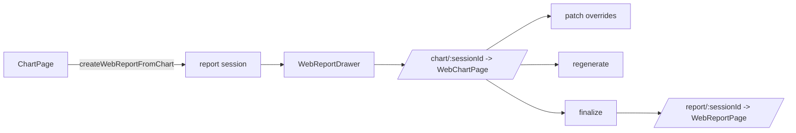

# Frontend Page Feature Flow Map

## Purpose

This document maps the current frontend pages, their responsibilities, their direct dependencies, and the navigation/data flow between them.

The goal is to use this as a working reference when:

- splitting features into modules
- shrinking page responsibilities
- deciding where new UI or state should live
- planning later DB / persistence / backend integration

## Route Map

Defined in [frontend/src/main.tsx](/c:/interface/frontend/src/main.tsx).

| Route | Component | Role |
| --- | --- | --- |
| `/` | `App -> UploadPage` | Main upload entry |
| `/chart` | `ChartPage` | Main analysis workspace |
| `/chart/:sessionId` | `WebChartPage` | Session-based doctor review chart |
| `/report` | `ReportPage` | Legacy/open report iframe page |
| `/report/:sessionId` | `WebReportPage` | Session-based full report entry |
| `/cornerstone_page` | `CornerstonePage` | Cornerstone sandbox/debug page |
| `/mpr_test` | `MprTestPage` | MPR / multiframe debug page |
| `/test` | `TestPage` | Misc test page |

## Page Summary

### 1. `/` -> `UploadPage`

File:
- [frontend/src/pages/UploadPage.tsx](/c:/interface/frontend/src/pages/UploadPage.tsx)

Purpose:
- Accepts upload input for image, single DICOM, or folder
- Decides which upload mode is active
- Starts either chart analysis flow or patient report flow

Main features:
- single file selection
- folder selection via `webkitdirectory`
- folder DICOM parsing into `Study / Series`
- start analysis
- generate patient report

Main related modules:
- [frontend/src/components/upload/UploadPicker.tsx](/c:/interface/frontend/src/components/upload/UploadPicker.tsx)
- [frontend/src/features/upload/uploadSelection.ts](/c:/interface/frontend/src/features/upload/uploadSelection.ts)
- [frontend/src/features/upload/uploadApi.ts](/c:/interface/frontend/src/features/upload/uploadApi.ts)
- [frontend/src/features/upload/dicomFolderStudies.ts](/c:/interface/frontend/src/features/upload/dicomFolderStudies.ts)

Input state:
- `file`
- `folderFiles`
- `folderStudies`
- `language`

Output:
- navigate to `/chart`
- or navigate to `/report`

Important branch:
- folder mode currently does **not** send the full folder to backend
- instead it groups local files into studies/series and sends that structure into `ChartPage`

### 2. `/chart` -> `ChartPage`

File:
- [frontend/src/pages/ChartPage.tsx](/c:/interface/frontend/src/pages/ChartPage.tsx)

Purpose:
- Unified analysis workspace for image and DICOM/CT review
- Hosts viewer, odontogram, capture deck, report launcher, and review context

Main features:
- polling async detect job status
- overlay/original/heatmap view switching
- image viewer and Cornerstone viewer switching
- CT single/grid modes
- tools: pan, zoom, WL/WW, invert, rotate, flip, capture
- odontogram / tooth selection
- right-side tooth detail panel
- report floating launcher
- workspace sidebar with `Studies` and `Captures`
- capture deck thumbnail storage in memory
- drag capture from deck into empty grid slots
- folder-mode study/series selection

Main related modules:
- [frontend/src/components/BottomTeethChart.tsx](/c:/interface/frontend/src/components/BottomTeethChart.tsx)
- [frontend/src/components/RightPanel.tsx](/c:/interface/frontend/src/components/RightPanel.tsx)
- [frontend/src/components/WebReportDrawer.tsx](/c:/interface/frontend/src/components/WebReportDrawer.tsx)
- [frontend/src/viewer/CornerstoneGridViewer.tsx](/c:/interface/frontend/src/viewer/CornerstoneGridViewer.tsx)
- [frontend/src/viewer/CornerstoneViewer.tsx](/c:/interface/frontend/src/viewer/CornerstoneViewer.tsx)
- [frontend/src/lib/webReportApi.ts](/c:/interface/frontend/src/lib/webReportApi.ts)
- [frontend/src/lib/webReportKeywords.ts](/c:/interface/frontend/src/lib/webReportKeywords.ts)

Input sources:
- upload state from `UploadPage`
- backend analysis result
- folder studies/series state
- local viewer interaction state

Key page-local states:
- `result`
- `viewMode`
- `viewerMode`
- `workspaceSection`
- `captureGallery`
- `assignedCaptureSlots`
- `reportSessionId`
- `selectedFolderSeriesId`

Output:
- creates report session
- opens report drawer
- may later deep-link to session routes

### 3. `/chart/:sessionId` -> `WebChartPage`

File:
- [frontend/src/pages/WebChartPage.tsx](/c:/interface/frontend/src/pages/WebChartPage.tsx)

Purpose:
- Session-based doctor review workspace
- Wraps `ChartPage` with server-backed review/finalization logic

Main features:
- poll web report session
- edit tooth review flags
- edit tooth note
- edit report note
- autosave overrides
- regenerate report
- finalize report
- reset tooth to AI values
- open report draft

Main related modules:
- [frontend/src/lib/webReportApi.ts](/c:/interface/frontend/src/lib/webReportApi.ts)
- [frontend/src/pages/ChartPage.tsx](/c:/interface/frontend/src/pages/ChartPage.tsx)

Key relation:
- `WebChartPage` is the session-driven orchestration layer
- `ChartPage` is reused as the visual chart/review surface

### 4. `/report` -> `ReportPage`

File:
- [frontend/src/pages/ReportPage.tsx](/c:/interface/frontend/src/pages/ReportPage.tsx)

Purpose:
- Legacy/simple report viewer page
- Opens a report URL inside an iframe

Main features:
- iframe embed of report URL
- open report in new tab
- return home

Main relation:
- used by direct report generation flow from `UploadPage`

### 5. `/report/:sessionId` -> `WebReportPage`

File:
- [frontend/src/pages/WebReportPage.tsx](/c:/interface/frontend/src/pages/WebReportPage.tsx)

Purpose:
- Session-based full report entry
- Redirects to the generated HTML report when ready

Main features:
- poll web report session
- detect `completed/finalized`
- redirect to `/api/web_report/session/:sessionId/report`
- expose PDF link if available
- link back to session chart

Main relation:
- full-report counterpart of `WebChartPage`

### 6. `/cornerstone_page` -> `CornerstonePage`

File:
- [frontend/src/pages/CornerstonePage.tsx](/c:/interface/frontend/src/pages/CornerstonePage.tsx)

Purpose:
- sandbox/debug page for single local file rendering
- compare different viewer wrappers and rendering paths

Main features:
- local image or DICOM upload
- DICOM inspection preview
- compare:
  - `CornerstoneViewer`
  - `CornerstoneGridViewer`
  - minimal/native debug viewers
  - raw preview image

Main relation:
- debugging page, not user workflow page

### 7. `/mpr_test` -> `MprTestPage`

File:
- [frontend/src/pages/MprTestPage.tsx](/c:/interface/frontend/src/pages/MprTestPage.tsx)

Purpose:
- isolated multiframe / MPR debugging page

Main features:
- local DICOM upload
- metadata probe
- multiframe volume inspection
- image pixel module / image plane module / VOI inspection
- volume creation diagnostics

Main relation:
- debugging page for CT geometry / multiframe problems

## Feature Ownership by Module

### Upload domain

- `UploadPage`
  - page orchestration
  - decide detect/report action
- `UploadPicker`
  - file/folder selection UI
- `uploadSelection`
  - normalize selected file(s)
- `uploadApi`
  - backend request layer
- `dicomFolderStudies`
  - folder DICOM parsing and `Study / Series` grouping

### Chart / viewer domain

- `ChartPage`
  - top-level workspace orchestration
  - viewer mode state
  - capture deck state
  - report launcher state
  - folder study/series selection state
- `CornerstoneGridViewer`
  - CT volume / MPR rendering
  - 3D preset selection
  - empty slot capture placement
- `CornerstoneViewer`
  - single stack viewer
- `multiframeLoader`
  - multiframe DICOM registration
  - frame geometry metadata
  - default VOI fallback

### Report domain

- `WebReportDrawer`
  - in-chart report dock UI
- `webReportApi`
  - session create / fetch / patch / regenerate / finalize
- `WebChartPage`
  - doctor review workflow
- `WebReportPage`
  - full report session entry
- `ReportPage`
  - plain iframe report page

## Navigation Flow

### A. Basic image/DICOM detect flow

### B. Folder DICOM flow

### C. Patient report flow

### D. Web report review flow

## Page-to-Page Relationship

### `UploadPage` -> `ChartPage`

Used when:
- async detection flow
- folder-based local DICOM study/series browsing

Transferred state examples:
- `jobId`
- `result`
- `previewUrl`
- `originalFile`
- `originalFolderMode`
- `originalFolderStudies`
- `folderSelectedSeriesId`
- `originalIsDicom`

### `UploadPage` -> `ReportPage`

Used when:
- direct patient report generation path

Transferred state:
- `reportHtml`
- `reportUrl`
- `analysisResult`
- `aiCommentary`
- `overlayUrl`
- `userName`

### `ChartPage` -> `WebReportDrawer`

Used when:
- user opens floating report workspace

Transferred/derived state:
- `result`
- `selectedTooth`
- `reportSessionId`

### `ChartPage` / `WebReportDrawer` -> `WebChartPage`

Conceptual session relation:
- same report session
- `WebChartPage` is the full session review surface
- `WebReportDrawer` is the in-chart compact review surface

### `WebChartPage` -> `WebReportPage`

Used when:
- report draft/final HTML needs full-page opening

## Current Folder-Series Handling

Current implemented behavior:

1. user selects a folder
2. `dicomFolderStudies.ts` groups files into:
   - study by `StudyInstanceUID`
   - series by `SeriesInstanceUID`
3. `UploadPage` passes grouped structure to `ChartPage`
4. `ChartPage` shows grouped studies in workspace sidebar
5. selected series becomes the active original CT source
6. `CornerstoneGridViewer` receives `files: File[]` with `scheme: 'dicomfolder'`
7. viewer registers each file into imageIds and builds volume from the whole series

Important limitation:
- this is currently local frontend volume construction
- it is not yet a backend study ingest pipeline

## State Persistence Status

### In memory only

Currently stored in React state only:
- capture deck items
- assigned capture slots
- workspace open/section state
- selected folder series in chart page

Result:
- browser refresh clears them

Related planning note:
- [frontend/docs/capture-deck-storage-plan.md](/c:/interface/frontend/docs/capture-deck-storage-plan.md)

## Recommended Future Modular Split

### Upload page split

- `pages/UploadPage.tsx`
  - page shell only
- `features/upload`
  - file selection normalization
  - folder study parsing
  - detect/report requests
- `components/upload`
  - input controls only

### Chart page split

Suggested future subdomains:

- `features/chart/workspace`
  - studies sidebar
  - capture deck
- `features/chart/viewer`
  - viewer mode / layout / tool state
- `features/chart/report`
  - report launcher / report dock coordination
- `features/chart/capture`
  - capture generation, thumbnailing, slot assignment
- `features/chart/odontogram`
  - chart status mapping / tooth selection

### Report split

- `features/report/session`
  - fetch/poll/patch/regenerate/finalize
- `features/report/editor`
  - tooth review form
  - report note
- `features/report/navigation`
  - chart/report route handoff

## Debug / Non-Product Pages

These routes are currently technical support pages, not main product pages:

- `/cornerstone_page`
- `/mpr_test`
- `/test`

They should stay separate from production workflow logic unless promoted intentionally.

## Short Operational Summary

If you need to know where to add a feature:

- upload entry logic -> `UploadPage` / `features/upload/*`
- study/series grouping -> `dicomFolderStudies.ts`
- analysis workspace behavior -> `ChartPage`
- CT volume rendering -> `CornerstoneGridViewer`
- multiframe geometry / default VOI -> `multiframeLoader.ts`
- report session actions -> `webReportApi.ts`
- compact in-chart reporting -> `WebReportDrawer`
- full doctor review workflow -> `WebChartPage`
- full report redirect/open -> `WebReportPage`
